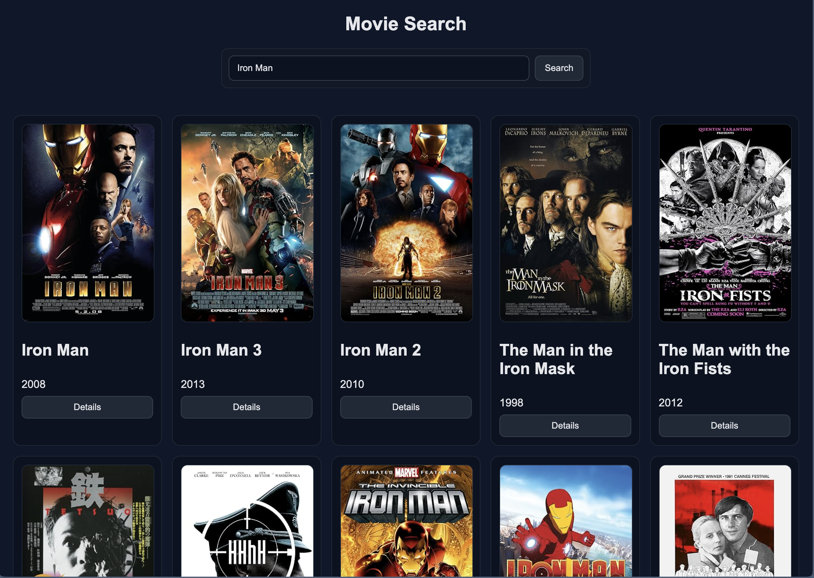
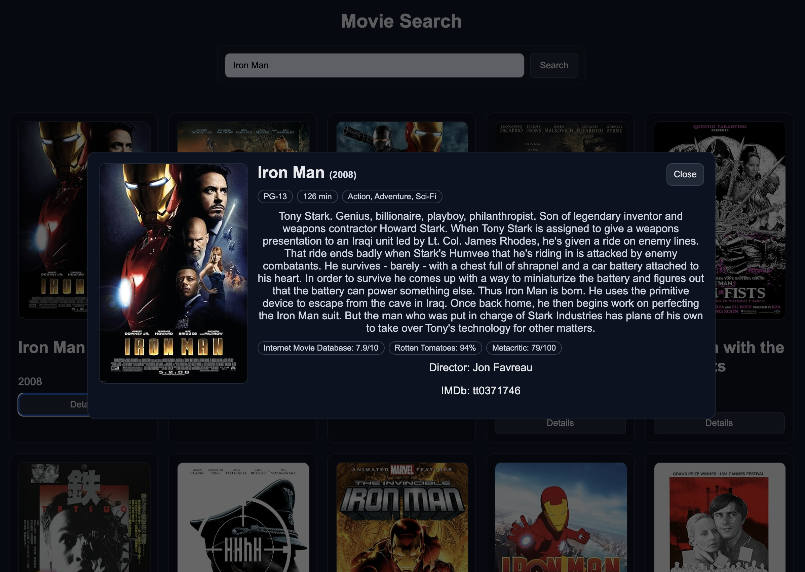

# 🎬 Movie Info Search App

A simple and responsive web application that lets users search for movies, view posters, and open detailed information in a modal overlay — powered by the [OMDb API](https://www.omdbapi.com/).

Built with **HTML**, **CSS**, and **JavaScript** using only the Fetch API and DOM manipulation (no frameworks).

---

## 🌟 Features

- **Movie Search:** Fetches movie data from the OMDb API by title  
- **Poster Grid:** Displays search results in clean, responsive cards  
- **Dynamic Overlay:** Click “Details” to view full movie info (plot, rating, genre, runtime)  
- **Loading & Error States:** Handles loading indicators and failed searches gracefully  
- **Responsive Layout:** Works on desktop, tablet, and mobile  
- **Accessible Modal:** Close with ESC, backdrop click, or the Close button  

---

## 🖥️ Preview

---

## 🧩 Tech Stack

| Category | Technology |
|-----------|-------------|
| Language | JavaScript, HTML, CSS |
| API | [OMDb API](https://www.omdbapi.com/) |
| Hosting | GitHub Pages |
| Tools | Fetch API, Async/Await, DOM Manipulation |

---

🔗 **Live Demo:** [https://Dorantes98.github.io/movie-info-search](https://Dorantes98.github.io/movie-info-search)

---

👨‍💻 **Author:** [Dominick Dorantes](https://github.com/Dorantes98)